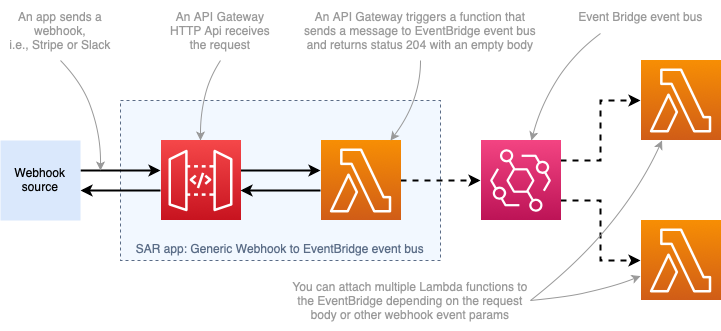

# Generic webhook to EventBridge event bus

This project is a serverless application that receives a webhook via POST or GET HTTP method, sends the received data to the EventBridge event bus, and replies with the `200 OK` response to the webhook sender.

The architecture for this app looks like the following diagram:




This app contains the following components:

1. _An API Gateway HTTP API endpoint_ -  a new API Gateway HTTP API is cheaper and less powerful than the REST API, but it has everything we need for the common webhook.
2. _A Lambda Function_ - that we use to process the request, send it to the EventBridge event bus, and immediately return the `204 OK` response to the API Gateway.

## Deploy and use the application

You can deploy this app from Serverless Application Repository (SAR) or manually, using the Serverless Application Model Command Line Interface (SAM CLI).

### Parameters

This application accepts the following two parameters:

- `EventBusName` (required) - a name of your EventBridge event bus
- `EventSource` (optional) - a name of your event source (defualt: webhook)

### Install from SAR

Go to the [Generic webhook to EventBridge](https://serverlessrepo.aws.amazon.com/applications/arn:aws:serverlessrepo:us-east-1:721177882564:applications~generic-webhook-to-eventbridge) App on the AWS Serverless App repo, click Deploy and follow the wizard to configure the app.

Or use with AWS SAM by adding the following resource:

```yaml
GenericWebhookToSns:
  Type: AWS::Serverless::Application
  Properties:
    Location:
      ApplicationId: arn:aws:serverlessrepo:us-east-1:721177882564:applications~generic-webhook-to-eventbridge
      SemanticVersion: 1.0.0
    Parameters:
      EventBusName: Name of your EventBus
      EventSource: Optional name of your event source (default: webhook)
```

### Install manually

The SAM CLI is an extension of the AWS CLI that adds functionality for building and testing Lambda applications. It uses Docker to run your functions in an Amazon Linux environment that matches Lambda. It can also emulate your application's build environment and API.

To use the SAM CLI, you need the following tools.

* SAM CLI - [Install the SAM CLI](https://docs.aws.amazon.com/serverless-application-model/latest/developerguide/serverless-sam-cli-install.html)
* Node.js - [Install Node.js 10](https://nodejs.org/en/), including the NPM package management tool.
* Docker - [Install Docker community edition](https://hub.docker.com/search/?type=edition&offering=community)

To build and deploy your application for the first time, run the following in your shell:

```bash
yarn run build
sam deploy --guided
```

The first command will build the source of your application. The second command will package and deploy your application to AWS, with a series of prompts.

You can find your API Gateway Endpoint URL in the output values displayed after deployment.

### Use with SAM

You can use Generic webhook to SNS topic application in your SAM application by adding it as a nested app in your SAM template.

A minimal template can look similar to the following one:

```yaml
AWSTemplateFormatVersion: '2010-09-09'
Transform: AWS::Serverless-2016-10-31
Description: A cool SAM app
  
Globals:
  Function:
    Timeout: 10
    Runtime: nodejs12.x

Resources:
  PaymentEventBus: 
    Type: AWS::Events::EventBus
    Properties: 
        Name: paymentEventBus

  StripeWebhook:
    Type: AWS::Serverless::Application
    Properties:
      Location:
        ApplicationId: arn:aws:serverlessrepo:us-east-1:721177882564:applications/generic-webhook-to-eventbridge
        SemanticVersion: 1.0.0
      Parameters:
        EventBusName: paymentEventBus
        EventSource: stripe-webhook

  StripeWebhookFunction:
    Type: AWS::Serverless::Function
    Properties:
      CodeUri: build/webhook
      Handler: lambda.handler
      Events:
        StripeWebhookEventNotification:
          Type: SNS
          Properties:
            Topic: !GetAtt StripeWebhook.Outputs.WebhookTopicArn
            
  WebhookProcessorFunction:
    Type: AWS::Serverless::Function
    Properties:
      CodeUri: build/charge-processor
      Handler: lambda.handler
      Events:
        OnChargeSucceeded:
          Type: CloudWatchEvent
          Properties:
            EventBusName: paymentEventBus
            Pattern:
              detail:
                body:
                  type:
                  - charge.succeeded

Outputs:
  StripeWebhookUrl:
    Description: "Webhook URL"
    Value: !GetAtt StripeWebhook.Outputs.WebhookApiUrl
```


This will deploy the Webhook app from SAR and a Lambda function that will be triggered when a webhook receives the "charge.succeeded" event.

Important parts of the template:

- `StripeWebhook (AWS::Serverless::Application)` is a resource that deploys a Generic webhook to EventBridge event bus app from SAR
- `ApplicationId: arn:aws:serverlessrepo:eu-central-1:721177882564:applications~generic-webhook-to-eventbridge` is a SAR app ARN (see the [Install from SAR](#install-from-sar) section).

In production, you should consider adding a few more things, such as:

- Lambda destinations for handling errors
- Enable monitoring (i.e., Amazon X-Ray)
- Assigning a custom domain/path to your webhook

### Event structure

The event will have the following structure:

```json
{
    "version": "0",
    "id": "12345678-1a2b-3c4d-5e6f-123456789abc",
    "detail-type": "Webhook, source: webhook",
    "source": "webhook",
    "account": "123456789012",
    "time": "2019-12-27T19:24:48Z",
    "region": "us-east-1",
    "resources": [],
    "detail": {
      // A valid API Gateway HTTP API event with parsed body if it's a JSON
    }
}
```

## License

MIT, see [LICENSE](./LICENSE).